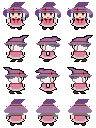
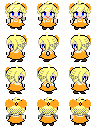
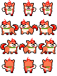
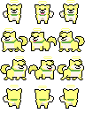
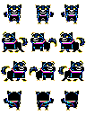
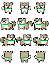

# キャラクター画像

RPG等に利用される、ドット絵のキャラクター画像です。

[akashic-simple-character4](https://github.com/shinonomekazan/akashic-simple-character4)等のライブラリを使うと、効率よくゲームに導入することができます。

## プレイヤーキャラクター

### 兵士

### 魔女

### 村人

### 犬

