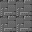
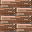

# マップチップ画像

RPG等に利用される、マップチップ用の画像です。

## オートタイル（ウディタ仕様）

WOLF RPGエディター仕様のオートタイル画像です。

このオートタイルは[akashic-tile-ex](https://github.com/shinonomekazan/akashic-tile-ex)等のライブラリを使うと、効率よくゲームに導入することができます。

### 道

## 単独のチップ

普通のチップです。[akashic-tile](https://github.com/akashic-games/akashic-tile)や[akashic-tile-ex](https://github.com/shinonomekazan/akashic-tile-ex)等のライブラリを使うと、効率よくゲームに導入することができます。

なお、画像一つ一つでは扱いにくい場合、本文書末尾を参照してください。

### 床

床です。

- 
- 

## ボタン

踏んで動かすタイプのボタンです。

- 
- 
- 
- 
- 
- 

## ドア

ドアです。

- 
- 

## 宝箱

宝箱です。お宝が入っていたり、空だったり。

- 
- 

## 画像の合成について

画像の合成は色々ツールがありますが、JavaScriptだけでやるなら[spritesmith](https://www.npmjs.com/package/spritesmith)の利用が便利です。

このフォルダにも、`npm run genearte` を実行すると、spritesmithによってtileフォルダ以下が一枚の画像として出力されるサンプルを掲載しています。
